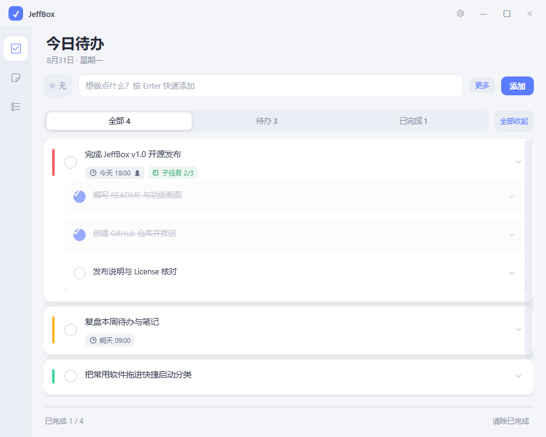
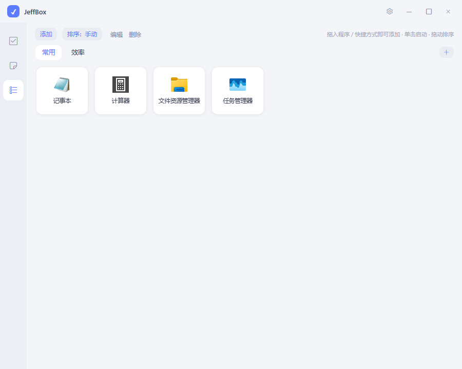
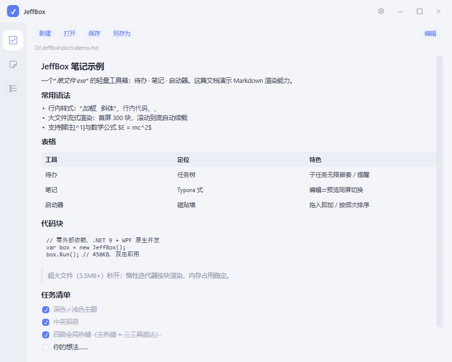
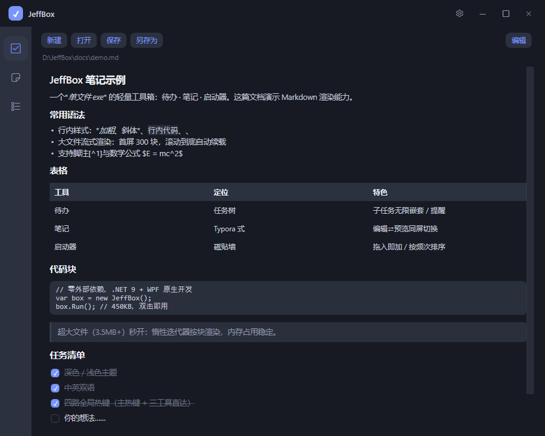

# JeffBox

**[中文说明](README.zh-CN.md)**

> A 450 KB single-file Windows desktop toolbox — Todo · Markdown Notes · App Launcher, three tools in one exe.

    

| Todo (light) | Launcher |
|:-:|:-:|
|  |  |

| Notes · reading mode | Notes · dark theme |
|:-:|:-:|
|  |  |

## Why JeffBox

- **One exe, double-click and go.** Built natively on .NET 9 + WPF, zero external dependencies, ~450 KB as a single-file publish.
- **Your data never leaves your PC.** Everything is stored in `%APPDATA%\JeffBox`. No account, no cloud sync, no telemetry.
- **Always one hotkey away.** Tray-resident with four global hotkey slots — one master hotkey to summon the window, plus one direct hotkey for each tool (Todo / Notes / Launcher).
- **Performance first.** A 3.5 MB+ Markdown document opens instantly (streaming block-by-block rendering); long todo lists are UI-virtualized.
- **Dark / light themes + English / 简体中文 UI**, polished with rounded cards, overlay scrollbars and smooth animations.

## Features

### ✅ Todo

- Task tree: unlimited nesting of subtasks, expanded by default, collapse/expand-all in one click
- Priority (none/low/med/high with color bars), due dates, in-app reminders
- Markdown-lite details with `Ctrl+V` image paste (blank-clipboard detection included)
- Filters (all/active/done), progress display, hover card preview

### 📝 Notes (Markdown)

- Typora-style: edit ⇄ preview toggled in the same pane
- Double-click a `.md` file to open it with JeffBox (optional file association, reversible)
- Full syntax: headings, tables, code blocks, quotes, task lists, nested lists, `~~strikethrough~~`, `==highlight==`, footnotes, inline & block math
- Streaming renderer for huge files (first 300 blocks, auto-append on scroll); very large files fall back to read-only preview
- Encoding-aware (BOM → UTF-8 → GB18030), atomic writes never corrupt your files

### ⚡ Launcher

- Tile wall: **single click to launch**, system icons extracted automatically (including `.lnk`; falls back to a generic icon if the target is gone)
- **Drag & drop to add** apps, shortcuts, files or folders
- **Category tabs**: create with `＋`, rename/sort/delete via right-click; drag a tile onto a tab to move it across categories
- **Drag to reorder**, or auto-sort by **launch frequency** (hover a tile to see its count)
- Remembers the last tab and sort mode; migrates legacy flat data automatically

### Global

- Tray-resident (switchable to "exit on close"), optional auto-start, single instance with argument forwarding
- **Fully customizable hotkeys**: click the box and just press the combo. On failure, three-layer conflict diagnosis — a knowledge base of common defaults (WeChat/QQ/DingTalk/NetEase/Snipaste…), **live response forensics** (names the app that actually reacted to your keypress), then generic guidance. Reserved combos (Alt+F4 etc.) are blocked up front
- Window state memory: position/size/maximized, multi-monitor safe
- **Open where your mouse is**: summon the window by hotkey, tray icon or shortcut and it appears on the mouse's monitor (centered) or right beside the cursor — configurable in Settings, off by default
- Recently-opened documents list in Notes

## Getting started

**Option 1 — grab a release**

Two builds are published for every release:

- **`JeffBox-SelfContained.exe`** (163 MB) — recommended for most users: bundles the .NET runtime, nothing to install, just download and run
- **`JeffBox.exe`** (455 KB) — lightweight build, requires .NET Desktop Runtime 9.x (most Windows 10/11 machines already have it or will be prompted once)

**Option 2 — build from source**

```bash
git clone https://github.com/Jeffrey56400/JeffBox.git
cd JeffBox

# run for debugging
dotnet run

# publish a single-file exe (~450 KB)
dotnet publish -c Release -r win-x64 --self-contained false -p:PublishSingleFile=true -o publish
```

Requires .NET SDK 9.0+, Windows 10 1809+.

## Default shortcuts

| Action | Default | Notes |
| --- | --- | --- |
| Show / hide window | `Ctrl+Alt+T` | Master hotkey, fully customizable |
| Direct to Todo / Notes / Launcher | unbound | Press any combo in Settings, e.g. `Ctrl+Alt+D` |
| Notes: new / open / save / edit⇄preview | `Ctrl+N / O / S / E` | |
| Launcher: edit / delete tile | `F2 / Delete` | single click launches |

## Data & privacy

- All data lives in `%APPDATA%\JeffBox` (`todos.json` / `tools.json` / `settings.json` / `attachments\`). Delete that folder to wipe everything.
- No network calls, no telemetry, no auto-update. The only outbound behavior is opening links you click.
- Saves are atomic (temp file + replace); corrupt files get a `.corrupt-*` backup and writes are halted instead of overwriting.

## Project layout

```
JeffBox/
├── MainWindow.xaml(.cs)      # shell: custom title bar, tray, hotkeys, settings overlay
├── TodoViewModel.cs          # todo-tree viewmodel (subtask sync, filtering, breadcrumbs)
├── MarkdownLite.cs           # streaming Markdown renderer (lazy block iterator)
├── Models/TodoItem.cs        # task-tree model (legacy format auto-migration)
├── Services/
│   ├── TodoStorage.cs        # todo persistence (atomic writes, corruption guard)
│   ├── LauncherStorage.cs    # launcher persistence (multi-category)
│   ├── AppSettings.cs        # settings persistence (window state, hotkeys, theme)
│   ├── AppPaths.cs           # data directory + legacy migration
│   ├── Theme.cs / Loc.cs     # theme palettes / i18n dictionaries
│   ├── HotkeyInfo.cs         # hotkey parsing, reserved combos, conflict KB
│   ├── IconExtract.cs        # shell icon extraction (.lnk + missing-target fallback)
│   └── Attachments.cs        # todo image attachments (path-traversal guard)
└── Views/
    ├── MdToolView.*          # notes: edit/preview, chunked loading, encoding detection
    ├── LaunchToolView.*      # launcher: tiles, drag sorting, category tabs
    ├── HotkeyBox.*           # reusable hotkey capture box (low-level keyboard hook)
    └── InputDialog.cs        # lightweight input dialog
```

## Technical highlights

- **Streaming Markdown rendering** — `EnumerateBlocks()` lazily yields UI elements block by block; the first screen renders 300 blocks and more are appended near the bottom, so multi-MB docs open instantly with flat memory
- **Three-layer hotkey conflict diagnosis** — Windows offers no API to query hotkey ownership, so JeffBox combines a defaults knowledge base (checked against running processes) with **live response forensics**: a low-level keyboard hook snapshots the foreground before dispatch and names the app that reacts to your keypress
- **Custom title bar done right** — WindowChrome maximization is compensated with `SM_CXSIZEFRAME + SM_CXPADDEDBORDER` metrics, avoiding the classic 8-px clipped-content bug
- **Clipboard image defense chain** — raw PNG bytes first, DIB alpha-loss detection for fake-transparency images, blank-image warnings
- **Zero dependencies** — tray, hotkeys, Markdown, icon extraction and encoding detection are all BCL/P-Invoke; no third-party packages

## Roadmap

- [ ] Export / import (todo backup, notes batch)
- [ ] Calendar view for todos
- [ ] Notes outline sidebar & full-text search
- [ ] Custom tile icons for the launcher

Feature requests and feedback are welcome in Issues (中文/English).

## Contributing

PRs welcome. Please attach screenshots or repro steps with changes, and keep the two ground rules: zero external dependencies, all data local.

## License

[Apache-2.0](LICENSE) © 2026 Jeffrey56400
